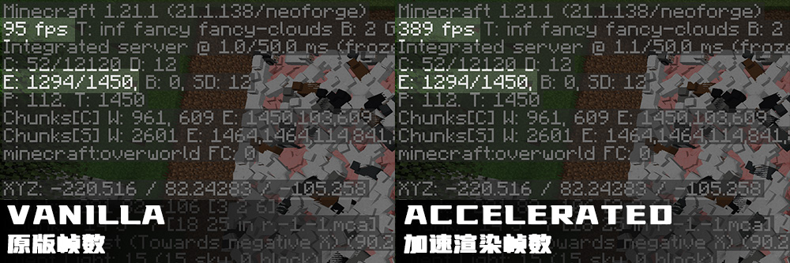

# 加速渲染 ([EN version](#english))

**这里是加速渲染的Fabric移植，若阁下想要查看适用于NeoForge的加速渲染，请前往[本家](https://github.com/Argon4W/AcceleratedRendering)**

加速渲染是一个客户端实体渲染优化MOD.
目的是改善在渲染大量实体或拥有大量顶点的复杂MOD实体的情况下产生的渲染性能问题,
与此同时尽可能与光影MOD和其他MOD及其自定义实体兼容.

## 🍝赞助
加速渲染基本由我一人完成, 花费了数千小时对其进行开发和测试, 才得以发布.
来自广大玩家们的赞助将用于加速渲染后续的更快的开发, 创新和优化, 感谢所有支持者!
如果你喜欢这个MOD, 并且想要支持加速渲染的开发, 请前往[爱发电](https://afdian.com/a/argon4w)为狐狸买一份意面

## ✨为什么需要这个MOD

Minecraft拥有一个羸弱的, 继承使用OpenGL立即模式的老版本的渲染系统以用来渲染实体和方块实体.
这个渲染系统会在**CPU**上**单线程**每帧变换和上传实体渲染所需要的顶点.
这就导致有巨量的时间被浪费在这些单线程执行的操作上, 导致了在渲染大量顶点时CPU其他核心和GPU空闲, 而FPS却十分低的奇异景象.

## ⚙️工作原理

加速渲染构建了一个独特的渲染管线, 将变换前的顶点缓存至模型中, 并在需要渲染时将其提交到GPU使用计算着色器进行多线程并行变换.
之后使用原本渲染系统中所使用的着色器进行渲染绘制. 通过这个渲染管线, 加速渲染可以在将实体渲染效率大幅提升,
将CPU压力转移的同时维持对光影MOD的兼容性 (当前兼容Iris Shaders). 并且所有渲染特性都可以被关闭以保证兼容性.

## 🖥️硬件要求

加速渲染因为使用了持久映射缓冲区(Persistently Mapped Buffer)和计算着色器, 因此需要OpenGL 4.6才能正常工作.
理论上NVIDIA GT 400 Series, Intel HD Graphics 520/530及以上的显卡可以满足这个要求.
加速渲染已经在发布前在NVIDIA GTX 1660Ti Max-Q, NVIDIA RTX 3070Ti Laptop, NVIDIA RTX 4090 Laptop, RX 580, RX 5600XT上经过测试.
移动设备目前**不受支持**.

## 🛠️配置
配置文件可以在``<Minecraft安装位置>/.minecraft/config/acceleratedrendering-client.toml``找到. 你可以通过配置文件修改加速特性或在游戏内进行修改.
部分特性可能需要重启游戏才能生效. 你可以在``模组 > Accelerated Rendering > 配置``找到游戏内配置编辑器.
如要让加速物品渲染正常工作, 请在"核心配置" (Core Settings) 处开启"强制加速半透明" (Force Translucent Acceleration).

# AcceleratedRendering

**This is the Fabric version of AcceleratedRendering, if you need the NeoForge supported version, please visit [here](https://github.com/Argon4W/AcceleratedRendering)**

This is a client side only entity rendering optimization MOD, aiming at improving performance when rendering large amount of entities
or complex modded entities with significant amount of vertices with compute shaders on GPU while being compatible with shader packs,
other MODs and their entities.

## 🍝Sponsorship

This MOD is almost done by myself and takes thousands of hours of my own time working and testing on it to be released.
Sponsorships from players can ensure the future development, innovation and optimization of this MOD. Thanks for everyone
that support this MOD! If you like it and want to support my work on development of AcceleratedRendering, please consider sponsor me at [爱发电](https://afdian.com/a/argon4w)

## ✨Why need this MOD

Minecraft has a poor immediate rendering system for rendering entities (including block entities) that is inherited from
OpenGL immediate rendering mode that older versions of Minecraft uses. It transforms and uploads vertices on the **single render thread** on **CPU**
every frame the entities are rendered, which takes a huge amount of time spending on these operations and left CPU and GPU idle with a very low FPS
when rendering large amount of vertices.

## ⚙️How it works

AcceleratedRendering constructs a unique rendering pipeline that caches the "original" vertices (vertices before the transform)
into meshes and transforms them parallel in GPU using compute shaders. Then draw the transformed vertices with the original shader.
In this way, this MOD can make entity rendering much more efficient by moving off transforming stress from the CPU
at the same time being compatible with shader packs (currently support Iris Shaders). All acceleration features can be disabled
for better compatibility.

## 🖥️Hardware Requirements

AcceleratedRendering requires OpenGL 4.6 to work properly for the usage of persistently mapped buffers and compute shaders.
Graphics cards like NVIDIA GT 400 Series and Intel HD Graphics 520/530 or newer will fit this requirement.
This MOD has been tested on NVIDIA GTX 1660Ti Max-Q, NVIDIA RTX 3070Ti Laptop, NVIDIA RTX 4090 Laptop, RX 580, RX 5600XT.
Mobile devices are **not currently supported**.

## 🛠️Configuration

Configuration file can be found in ``<your Minecraft>/.minecraft/config/acceleratedrendering-client.toml``. You can modify
acceleration features in this file or in game (some specific configurations needs to restart the game to take effect).
In game configuration editor can be found in ``Mods > Accelerated Rendering > Config``.
"Force Translucent Acceleration" in "Core Settings" is required to be enabled in order that accelerated item rendering can work properly.